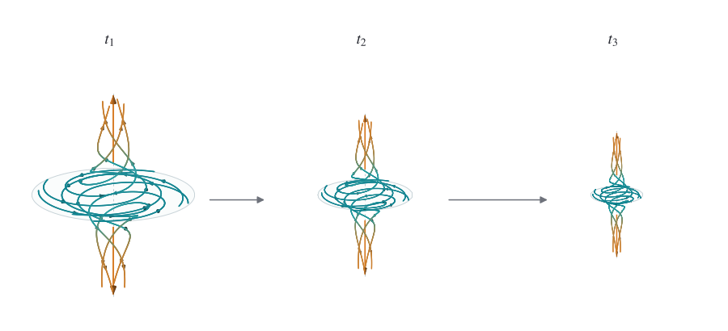
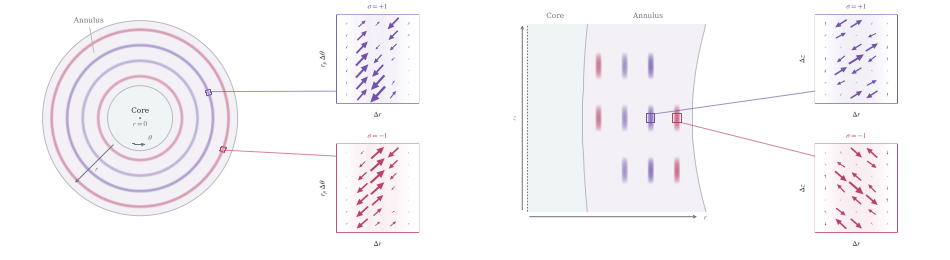

# 나비에–스토크스 밀레니엄 문제에 관하여

**문서 버전: v2.1**  
**기준 원문: 2026년 9월 8일 OpenAI 발표문 및 증명 논문**

> 이 문서는 OpenAI 발표의 핵심 주장과 연구 과정, 주요 수치를 쉽게 읽을 수 있는 한국어 평서체로 정리한 상세 요약이다. 공식 번역문은 아니다.

- 원문: [On the Navier–Stokes Millennium Prize Problem](https://openai.com/index/navier-stokes-solution/)
- 발표: OpenAI
- 공개일: 2026년 9월 8일

---

## 1. 무엇을 발표했는가

OpenAI는 밀레니엄 문제 가운데 하나인 나비에–스토크스 방정식의 존재성과 매끄러움 문제에 대한 해법을 공개했다고 발표했다. 내부 AI 시스템이 만든 해석적 증명과 Lean으로 형식화한 증명을 함께 제시했다. 핵심 결론은 매끄럽게 시작한 유체에서도 유한한 시간 안에 속도가 무한히 커지는 특이점이 생길 수 있다는 것이다.

---

## 2. 문제의 의미

나비에–스토크스 방정식은 물이나 공기 같은 유체의 움직임을 나타낸다. 항공기 설계, 일기예보, 혈류 연구 등에 쓰인다. 이 방정식은 유체를 개별 분자의 집합이 아니라 연속된 물질로 다룬다.

오랫동안 풀리지 않은 질문은 매끄럽게 시작한 3차원 비압축성 유체의 운동이 항상 매끄럽게 유지되는가 하는 것이었다. 특이점이 생긴다는 말은 유체의 속도가 유한한 시간 안에 제한 없이 커진다는 뜻이다. 실제 유체가 무한한 속도로 움직일 수는 없으므로, 이런 결과는 연속체 모형으로서 방정식의 적용이 깨지는 지점을 뜻한다.

---

## 3. OpenAI가 제시한 결과

OpenAI의 시스템은 처음에 정지해 있던 매끄러운 유체에 매끄러운 외력이 가해질 때 특이점이 생기는 구성을 제시했다. 이 과정에서도 전체 에너지는 유한하게 유지된다. OpenAI는 이 결과가 밀레니엄 문제의 공식 진술 가운데 C와 D에 해당한다고 설명한다.

### 3.1 소용돌이 핵심부의 수축

해법의 중심에는 안쪽으로 말려 들어가면서 축 방향으로 길게 늘어나는 소용돌이가 있다. 아래 그림의 `t₁ < t₂ < t₃`은 특이점이 발생하는 시각에 가까워질수록 강한 흐름의 영역이 작아지고 속도는 증가하는 모습을 보여 준다. 핵심부의 반지름은 높이보다 더 빠르게 줄어든다.

  

<strong>그림 1.</strong> 유체가 안쪽으로 회전하며 들어가고 축 방향으로 빠져나가는 핵심부의 변화. 이미지 출처: OpenAI 증명 논문.

### 3.2 고리형 펄스와 섭동 속도

핵심부와 바깥 흐름이 만나는 고리 모양 영역에서는 운동량의 균형이 어긋난다. 연구진은 공간적으로 진동하는 펄스를 배치해 유체 자체의 비선형 운동이 부족한 운동량 전달을 보충하도록 구성했다. 왼쪽 그림은 일정한 높이에서 펄스가 완전한 고리를 이루는 모습을 보여 준다. 오른쪽 그림은 반지름과 축 방향으로 자른 단면을 보여 준다. 보라색과 붉은색은 서로 다른 두 펄스 계열이다.

  

<strong>그림 2.</strong> 고리형 펄스의 배치와 반지름·방위각·축 방향 섭동 속도. 이미지 출처: OpenAI 증명 논문.

가속도, 압력 기울기, 운동량 전달, 점성에 관련된 항들은 각각 크게 증가하면서도 정교하게 상쇄된다. 그 결과 속도는 제한 없이 커지지만 외력은 매끄럽게 유지되고 전체 에너지는 유한하게 남는다.

---

## 4. 증명을 찾은 과정

OpenAI는 2026년 8월 28일부터 수학 성능이 크게 향상된 새 내부 모델을 훈련했다고 밝혔다. 9월 1일에는 여러 밀레니엄 문제와 관련 문제를 병렬로 검토하는 작업을 시작했다. 에이전트들은 저장된 인터넷 자료를 읽고 코드를 실행할 수 있었으며, 여러 그룹으로 나뉘어 서로 다른 접근법을 시험했다.

나비에–스토크스 문제를 해결한 그룹에는 약 1만 개의 동시 에이전트가 참여했다. 별도로 약 100개의 에이전트가 약 50시간 동안 외력이 없는 오일러 방정식의 정칙성 문제를 검토해 반례를 만들었다. 이 결과가 나온 뒤 자원을 나비에–스토크스 문제에 집중했고, Codex로 여러 그룹의 중간 결과를 모아 다시 전달했다.

최초 실행부터 해법 도출까지 약 88시간이 걸렸다. 이어 GPT‑6 Astra가 Lean 형식화와 검증에 17시간을 사용했다. 나비에–스토크스 작업에서 에이전트들은 약 270만 개의 메시지를 주고받았고 약 1,300억 개의 출력 토큰을 사용했다.

---

## 5. 동시에 진행된 다른 연구와 우선권 문제

OpenAI는 연구를 시작하게 만든 소문이 Levent Alpöge와 뉴욕대학교 수학자 Tristan Buckmaster의 연구와 관련된 것이었다고 설명한다. 두 연구자는 외력이 있는 오일러 방정식 문제를 연구하고 있었다. OpenAI는 두 연구자의 결과가 먼저였다는 점을 인정하면서도, 자사 연구진과 에이전트가 공개 전에 그들의 연구 내용을 직접 보지는 않았다고 밝혔다.

다만 제품 사용 과정에서 얻은 비식별화 데이터가 모델 개선에 간접적으로 영향을 주었을 가능성까지 완전히 배제할 수는 없다고 덧붙였다. OpenAI는 양쪽의 오일러 결과도 외력의 유무가 다르며, 증명의 구체적인 내용 역시 상당히 다르다고 주장한다.

---

## 6. 연구 공개의 목적

OpenAI는 이번 결과로 밀레니엄 문제의 상금을 청구할 계획이 없다고 밝혔다. 공개 목적은 AI 모델의 과학·수학 연구 능력이 얼마나 빠르게 발전하고 있는지 알리는 데 있다고 설명한다. 연구 과정에서는 기존의 최전선 모델 평가에 적용하는 감시와 격리 같은 안전조치를 유지했다고 밝혔다.

이 발표가 곧바로 최종적인 학계 인정을 뜻하지는 않는다. 공개된 논문과 Lean 증명은 독립적인 수학자들의 검토를 거쳐야 한다. 따라서 현재 단계에서는 ‘OpenAI가 해법과 형식 증명을 공개했다’고 표현하는 것이 가장 정확하다.

---

## 관련 자료

- [OpenAI 공식 발표문](https://openai.com/index/navier-stokes-solution/)
- [증명 논문 PDF](https://cdn.openai.com/pdf/32d9f210-8b73-45e0-91bc-82a30aef8a9a/navier-stokes.pdf)
- [Lean 형식 증명 저장소](https://github.com/openai/NavierStokesAndEuler)

## 저작권 및 이용 안내

이 문서는 OpenAI 원문의 내용을 이해하기 쉽게 요약한 비공식 한국어 자료다. 원문을 대신하는 공식 번역본이 아니며, 정확한 표현과 수학적 세부 내용은 원문과 증명 논문을 확인해야 한다. 두 Figure의 저작권은 원 출처에 있다.
